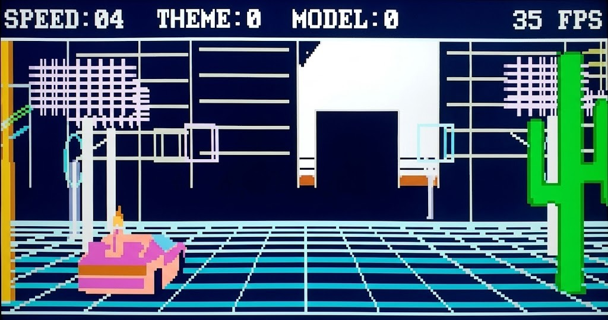
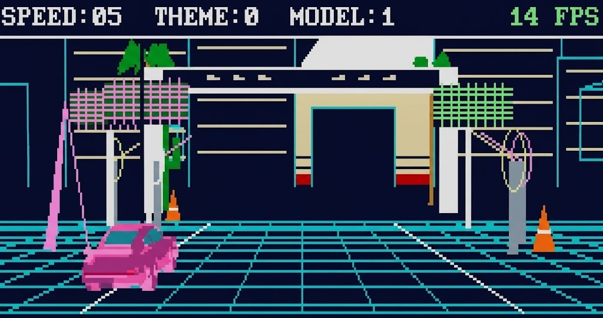
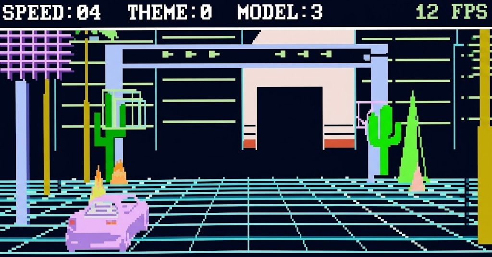
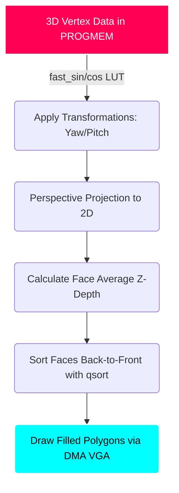

# 🌴 Synthwave 3D Visual Demo (ESP32 / VGA) 🏎️

Welcome to my custom 3D Synthwave Visual Demo, built entirely from scratch for the ESP32 microcontroller! This project is a love letter to the 80s outrun aesthetic, pushing a tiny $5 chip to render a fully 3D perspective grid, textured low-poly vehicles, and a gorgeous retro horizon directly to a VGA monitor without any dedicated GPU or hardware graphics accelerator!

## 📋 Table of Contents
- [📸 Screenshots](#-screenshots)
- [⚡ Features](#-features)
- [💻 Hardware Requirements](#-hardware-requirements)
- [🎮 Gamepad & Controls](#-gamepad--controls)
- [🧠 Architecture & Technical Deep Dive](#-architecture--technical-deep-dive)
- [🚀 Installation & Setup](#-installation--setup)
- [📜 Credits & Licenses](#-credits--licenses)
- [🗺️ Roadmap](#️-roadmap)

## 📸 Screenshots

*Note: The screenshots have been slightly adjusted/enhanced for presentation and may look slightly different from the raw monitor output.*

    
     <i>Driving the DeLorean DMC-12 through the synthwave grid.</i>

 

    
     <i>Cruising down the neon grid at sunset with the classic 1980 Porsche 911 Turbo</i>

 

    
     <i>Driving the Lamborghini Gallardo at high speeds.</i>

---

## ⚡ Features

*   **🎮 Wireless Bluetooth Control:** Full support for modern controllers (PS4, PS5, Xbox, Switch Pro) via the Bluepad32 library.
*   **🛣️ Infinite 3D Perspective Grid:** A mathematically accurate, infinite scrolling outrun grid that warps perspective in real-time.
*   **🌅 Synthwave Aesthetics:** A giant glowing sun, a retro city skyline, and that perfect retro color palette.
*   **🌴 Dynamic Environment:** Speed past beautifully rendered roadside scenery including neon palm trees, retro street lights, and glowing billboards.
*   **🚗 Multiple Vehicles:** Swap between iconic 80s and modern sports cars instantly.
*   **🎨 Dynamic Themes:** Change the world colors dynamically using the shoulder buttons.

---

## 💻 Hardware Requirements

To get the ultimate 30+ FPS arcade-smooth experience, you will need:

1.  **ESP32 Development Board:** I highly recommend the **Olimex ESP32-SBC-FabGL** board.
    *   *🚨 CRITICAL:* Your ESP32 **MUST HAVE PSRAM** (e.g., ESP32-WROVER with 4MB or 8MB PSRAM) to allocate the VGA DMA buffers alongside my heavy 3D structures.
2.  **VGA Monitor 🖥️:** If you are using a standard ESP32 on a breadboard, you can easily wire a VGA connector. The pins are configurable in the code (around line 312 of `Synthwave-FabGL.ino`), and they match the exact Olimex schematic configuration:
    *   **Red:** GPIO 22
    *   **Green:** GPIO 19
    *   **Blue:** GPIO 5
    *   **HSync:** GPIO 23
    *   **VSync:** GPIO 15
3.  **SPI MicroSD Card Module 💾:** Required to load the Gamepad configuration file. The SPI pins are selectable in the code (around line 324 of `Synthwave-FabGL.ino`), default wiring:
    *   **SCK:** GPIO 14
    *   **MISO:** GPIO 35
    *   **MOSI:** GPIO 12
    *   **CS/SS:** GPIO 13
4.  **Bluetooth Gamepad 🎮:** Any Bluetooth gamepad (PS4, PS5, Xbox One S, Nintendo Switch Pro, 8BitDo, etc).

---

## 🎮 Gamepad & Controls

This project is designed specifically for gamepads to provide an authentic retro experience. Keyboard support is not included. I utilize the phenomenal `Bluepad32` library to seamlessly handle wireless Bluetooth controllers.

### 🕹️ Controls
*   **D-Pad Left / Right:** Steer the car
*   **A (Cross) Button:** Accelerate
*   **Y (Triangle) Button:** Decelerate / Brake
*   **Right Analog Stick (X-Axis):** Manual Camera Yaw (Look around)
*   **L1 / R1:** Swap Vehicle Model
*   **L2 / R2:** Change Theme Colors
*   **Start Button:** Start Demo

### 🔧 How to Map Your Specific Gamepad

Different Bluetooth gamepads (PS4 vs Xbox vs 8BitDo) send different raw axis and button signals. 

To perfectly configure your gamepad, I have created a companion repository:
👉 **[FabGL Gamepad Tester & Configuration Mapper](https://github.com/UfkuAcik/FabGL-Gamepad-Tester-Configuration-Mapper)**

**How to use it:**
1.  Flash the Gamepad Tester sketch from the companion repo to your ESP32.
2.  Connect your gamepad via Bluetooth and use the visual interface on your monitor.
3.  Map your buttons visually on the screen and save the configuration to your MicroSD card.
4.  Flash **this Synthwave project** to your ESP32 (which already has your SD card connected). This demo will automatically read your saved `mappings.cfg` file from the SD card and apply your custom controls!

---

## 🧠 Architecture & Technical Deep Dive

This project pushes the ESP32 hardware to its absolute limits as a standalone graphics processor. Here is how I made it fast:

*   **⚡ Fast Math Bypass:** The ESP32's FPU is decent, but standard `sin()` and `cos()` functions are too slow for real-time 3D geometry transformation. I implemented a 256-entry Q15 Lookup Table (LUT) stored in `PROGMEM` for all trigonometric operations.
*   **🧠 PSRAM Memory Allocation:** Generating double-buffered VGA signals takes a huge chunk of internal SRAM. To prevent memory allocation panics, all of my heavy 3D rendering buffers (Z-depth sorting arrays, dynamically projected vertices, and visible face lists) are forcibly pushed to the external PSRAM.
*   **🎨 Painter's Algorithm & Culling:** I don't use a Z-Buffer (which would be far too slow to clear and calculate per-pixel on an ESP32). Instead, I use the Painter's Algorithm. First, I calculate the average Z-depth of each face. Then, I sort all faces using a fast `qsort`, and draw them from back to front!
*   **🗜️ Model Pre-Processing:** You cannot simply load `.obj` files at runtime. The car models are stored as static, highly-optimized constant arrays in `Src/Models.cpp`. I pre-calculated all face normals and vertex color IDs offline to maximize runtime rendering efficiency.

### 🖼️ Render Pipeline

---

## 🚀 Installation & Setup

I have embedded a highly-optimized, stripped-down graphics-only version of the library (`fabgl_lite`) directly into the source code (`Src/fabgl_lite`). 

### Steps to Compile:
1.  **Clone or Download** this repository.
2.  **Open** `Synthwave-FabGL.ino` in the Arduino IDE.
3.  **Install Bluepad32**: In your Arduino IDE, go to *Sketch -> Include Library -> Manage Libraries*, search for `Bluepad32` (by Ricardo Quesada), and install it.
4.  **ESP32 Core Version:** You MUST install the Espressif ESP32 board package version **`2.0.11`** (or the corresponding Bluepad32 core). **Do NOT install newer versions (like v3.x.x)** because the FabGL architecture cannot run properly on them.
5.  **Board Settings** (Crucial Step):
    *   **Board:** `ESP32 Dev Module` (or `esp32-bluepad32` boards if you installed the custom core).
    *   **Partition Scheme:** `Huge APP (3MB No OTA / 1MB SPIFFS)` *(If you don't set this, the 3D models will exceed the default flash limits!)*
    *   **PSRAM:** `Enabled`
    *   **Optimization:** Ensure Compiler Optimization is set to `-O3` for maximum framerate.
6.  **Compile & Upload!**

*(Note: If you already have the global `FabGL` library installed in your Arduino libraries folder, the IDE might throw a "Multiple libraries found" or "multiple definition" error. If this happens, simply delete or temporarily rename the global library from your Documents/Arduino/libraries folder, as the demo explicitly uses the built-in `Src/fabgl_lite` version).*

---

## 📜 Credits & Licenses

*   **Code License:** The source code of this project is licensed under the **GNU General Public License v3.0**. (See the `LICENSE` file for details).
*   **FabGL:** Built using the incredibly powerful [FabGL architecture by fdivitto](https://github.com/fdivitto/FabGL).
*   **Bluepad32:** Gamepad support provided by the phenomenal [Bluepad32 by Ricardo Quesada](https://github.com/ricardoquesada/bluepad32).

### 🚗 3D Model Licenses & Attribution
The 3D models included in `Src/Models.cpp` and `Src/Models.h` are third-party assets used under their respective Creative Commons licenses. **These assets are strictly bound by their original licenses and are exempt from the project's GPLv3 code license.**

*   **[DeLorean DMC - 12 stylized](https://sketchfab.com/3d-models/delorean-dmc-12-stylized-fb4295cfb64b47ca900559cb875886a0)** - 3D Model by *FPSunreal* (License: CC Attribution)
*   **[Ford Focus Low Poly](https://sketchfab.com/3d-models/ford-focus-low-poly-8b290646b8f14cbb80b8a6ff7b1820c1)** - 3D Model by *Iron Minecart2* (License: CC Attribution-NoDerivs)
*   **[Low Poly 1980 Porsche 911 Turbo](https://sketchfab.com/3d-models/low-poly-1980-porsche-911-turbo-a33e84dd9b3849519cb91b3a5ae0cf01)** - 3D Model by *3DShinobi* (License: CC Attribution)
*   **[Lamborghini Gallardo Low Poly](https://sketchfab.com/3d-models/lamborghini-gallardo-low-poly-463f8eb77d8046678782783bd754b4d2)** - 3D Model by *Iron Minecart2* (License: CC Attribution-NoDerivs)

---

## 🗺️ Roadmap

The journey doesn't stop here! I will be implementing the following major updates to push the ESP32 even further into the synthwave matrix:

*   **🛣️ Hilly Terrain & Road Curvature Engine:** I am planning to implement a dynamic terrain system where the grid realistically bends, waves, and curves using high-speed procedural sine lookups. Say goodbye to the flat world!
*   **🌅 Fully Dynamic VFX & Weather System:**
    *   **Seamless Day/Night Cycle:** The retro sun will slowly set as twinkling stars and moonlight emerge.
    *   **Neon Laser Tunnels:** Massive 4-segment alternating Magenta and Cyan tunnels will be generated for the car to blast through.
    *   **High-Speed Weather Effects:** I will introduce dynamic particles for high-speed rain and drifting snow! 🌨️
    *   **Raytraced-Style Reflections:** Real-time sun and billboard reflections bouncing off the glossy asphalt grid. ☀️
*   **🏎️ Arcade Gameplay Mechanics:** 
    *   **Nitro Boost:** Hit the boost to engage hyper-speed and apply heavy motion-blur effects.
    *   **Traffic & AI:** Generating procedural traffic vehicles to dodge and race against.
    *   **Score System:** Retro-style distance and combo multiplier scoring.
*   **🎵 Audio Engine (I2S):** I will add a standalone I2S background audio task to pump pure 8-bit Synthwave audio directly from the SD card.
*   **📺 CRT Post-Processing:** Simulating authentic retro monitor scanlines, chromatic aberration, and screen curvature entirely in software.

---
Created by UfkuAcik. See you in the grid! 🌴🏎️🔥
